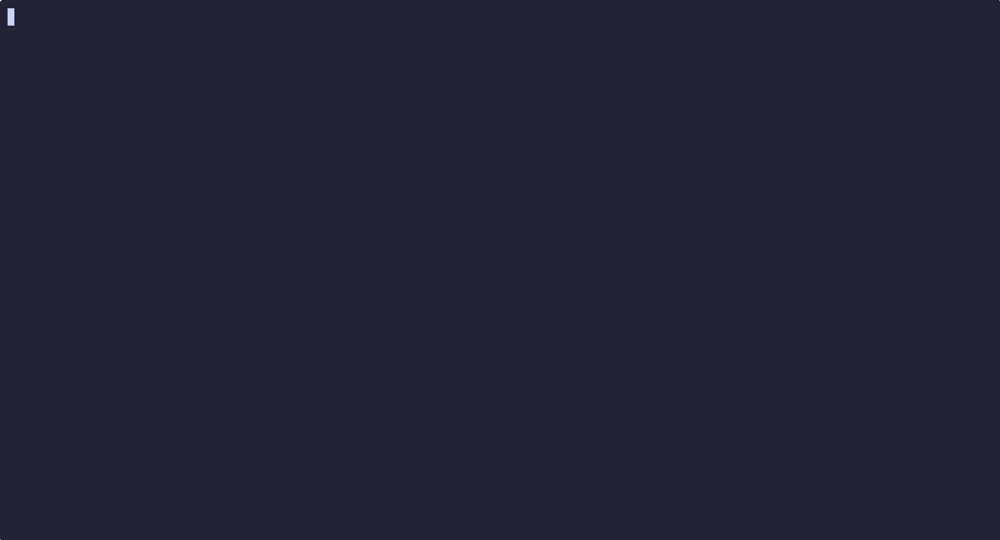

# 🔢 sudokute

A minimalist, terminal-native Sudoku implementation written in Go.

## Overview



Sudokute is a high-performance, zero-bloat Sudoku game designed specifically for the terminal. It prioritizes a distraction-free experience with a clean TUI (Terminal User Interface), providing a native-feeling puzzle environment without the overhead of heavy graphical frameworks.

## Features

- **Procedural Generation**: Uses a backtracking algorithm to generate unique, valid puzzles every session.
- **Real-time Validation**: Instant visual feedback for rule violations (duplicates in rows, columns, or subgrids).
- **Hybrid Input**: Fully supports both keyboard (including Vim-style `hjkl`) and mouse interactions.
- **Modern TUI**: 256-color palette with a centered, responsive layout and box-drawing characters for a polished look.
- **Dynamic Feedback**: Real-time timer, error counter, and number highlighting.

## Installation

You can download the pre-built binary file [here](https://github.com/ttasc/sudokute/releases/latest) or build from source:

```bash
git clone https://github.com/ttasc/sudokute.git
cd sudokute
go build -o sudokute
```

## Usage

Run the binary to start a new game:
```bash
./sudokute
```

### Controls

| Key | Action |
|-----|--------|
| `Arrows` / `hjkl` | Move cursor |
| `1-9` | Input number |
| `0` / `Space` / `Backsp` | Clear cell |
| `R` | Reset/New Game |
| `Q` / `Esc` / `Ctrl+C` | Quit |
| `Mouse Left Click` | Select cell |

## Architecture

The project follows a clean separation of concerns across five core files:

- **`main.go`**: The entry point. Handles the terminal initialization, event polling, and the main game loop.
- **`state.go`**: Defines the data structures (`GameState`, `Cell`) and implements the backtracking algorithm for puzzle generation.
- **`input.go`**: Maps hardware events (keyboard/mouse) to logical state mutations.
- **`validator.go`**: Implements Sudoku rule enforcement, error flagging, and win-condition checks.
- **`renderer.go`**: Manages the TUI layout, color constants, and drawing logic using `ttbox`.

## Design Philosophy

- **Minimalism**: No external configuration files or heavy dependencies.
- **Readability**: The codebase is intentionally flat and documented to be easily understood by contributors.
- **No Over-abstraction**: Prefers straightforward logic over complex design patterns that obscure intent.
- **Terminal-First**: Designed to look and feel like a native CLI tool rather than a ported GUI game.

## Contributing

Contributions are welcome. Please ensure that any pull requests:
1. Maintain the "suckless" philosophy (minimalist code).
2. Follow standard Go formatting (`go fmt`).
3. Focus on meaningful improvements to performance or UX.

## License

This project is licensed under the MIT License.
